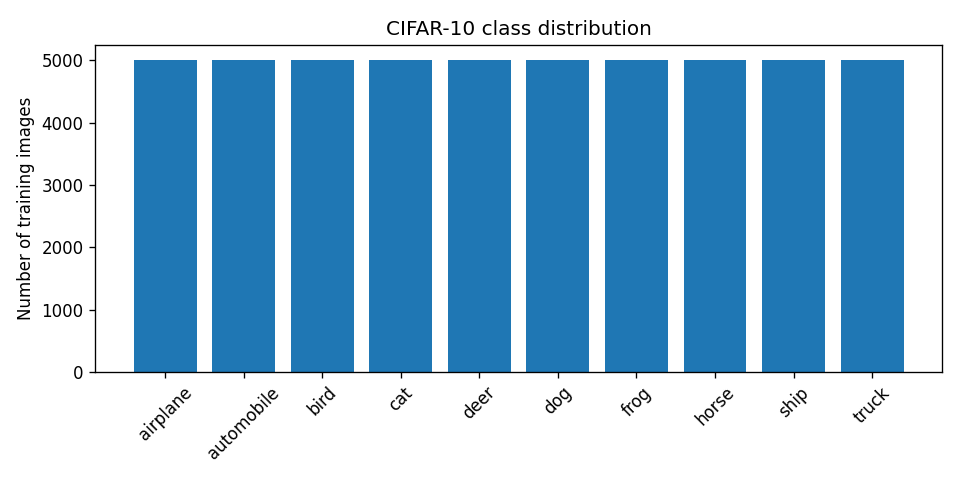
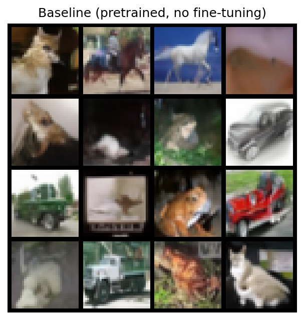
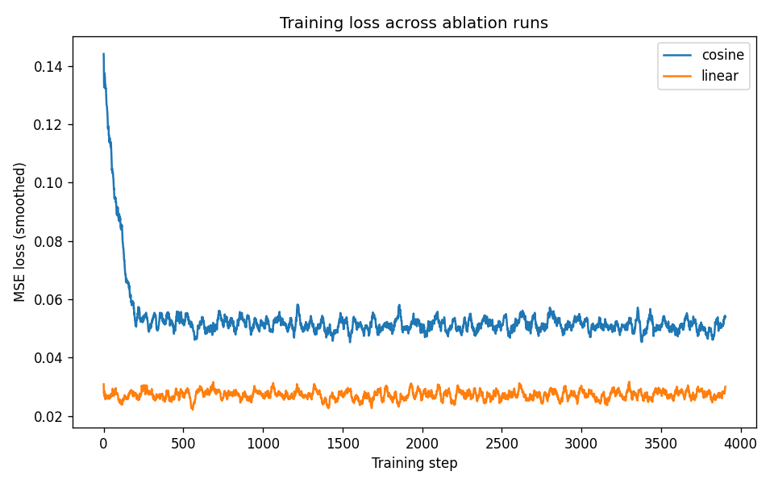
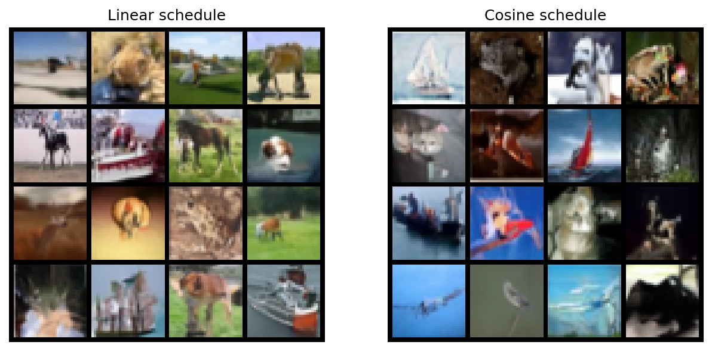
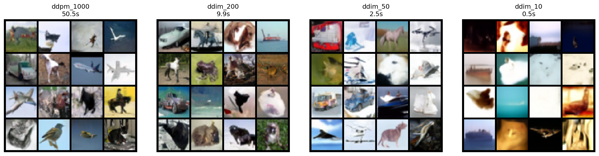
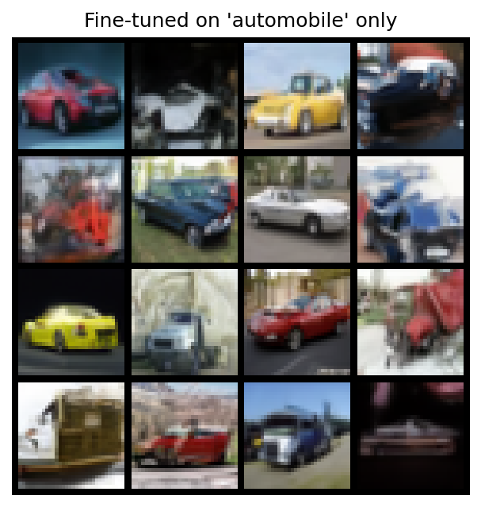

# Experimental Report: Fine-Tuning DDPM on CIFAR-10

**Author:** [your name here]
**Model family:** Diffusion Models (DDPM / DDIM)
**Dataset:** CIFAR-10

---

## 1. Overview

This project fine-tunes a pretrained Denoising Diffusion Probabilistic Model (DDPM) on CIFAR-10 and studies how two design choices — the **noise schedule** and the **sampling procedure** — affect training stability, sample quality, diversity, and inference cost. A third experiment looks at what happens when the training distribution is narrowed to a single class.

Per the assignment's model-initialization requirement, the pretrained backbone (`google/ddpm-cifar10-32`, a U-Net trained on CIFAR-10 at 32×32) is wrapped inside a custom PyTorch codebase rather than used through a ready-made generation pipeline. Concretely:

- The U-Net architecture and its pretrained weights come from 🤗 `diffusers` (`UNet2DModel`).
- The noise scheduler — the forward diffusion process, the DDPM ancestral reverse step, and the DDIM reverse step — is implemented from scratch (`schedulers.py`), following the equations in Ho et al. (2020) and Song et al. (2020) directly, rather than using `diffusers`' built-in `DDPMScheduler`/`DDIMScheduler` classes.
- The training loop, sampling loop, and evaluation utilities are custom.

This split (borrow the network, write the math) was a deliberate choice so that every number in this report can be traced back to an equation rather than a library call.

---

## 2. Data Exploration

CIFAR-10 consists of 60,000 32×32 RGB images across 10 classes, with 6,000 images per class in the full dataset (5,000 in the standard training split used here).

**Observations:**

- **Perfectly class-balanced.** Every class has exactly 5,000 training images, so no class-reweighting was needed for the main (multi-class) fine-tuning runs.
- **Low resolution dominates the task.** At 32×32, the generative challenge is less about fine detail and more about getting overall shape, texture, and color distribution right — a blurry-but-plausible "frog" reads as more successful than a sharp image with the wrong silhouette.
- **Intra-class variation is uneven across categories.** Natural categories like `bird`, `cat`, and `dog` show high pose, background, and color variation. Rigid man-made categories like `automobile`, `truck`, and `airplane` are comparatively more constrained in shape and viewpoint. This unevenness motivated the class-specific fine-tuning experiment in Section 6: a rigid, low-variance class like `automobile` should be an easier target for narrowing the training distribution than a high-variance class would be.
- **Preprocessing:** images are normalized to `[-1, 1]` (`mean=0.5, std=0.5` per channel) rather than the more common `[0, 1]`, matching the output range diffusion models are typically trained to predict noise against.

---

## 3. Baseline Generation

Before any fine-tuning, the pretrained checkpoint was used to generate samples directly, as a reference point for everything that follows.

The baseline already produces recognizable CIFAR-10-like objects — horses, trucks, frogs, cats — which is expected, since `google/ddpm-cifar10-32` was already trained on this exact dataset. This baseline serves two purposes: a sanity check that the wrapping code (model loading, custom DDIM sampling) is correct, and a quality floor that fine-tuning and ablations are compared against.

---

## 4. Ablation 1 — Noise Schedule: Linear vs. Cosine

**Setup:** two copies of the same pretrained backbone were fine-tuned for 5 epochs each, batch size 64, learning rate 1e-5, AdamW with cosine LR decay and gradient clipping (max norm 1.0) — identical in every respect except the diffusion noise schedule (`linear` vs. `cosine`, both at 1000 timesteps).

### Training loss

The linear schedule converged to a noticeably lower and more stable loss plateau (~0.025–0.03 MSE) than the cosine schedule (~0.05–0.055 MSE) under these identical fine-tuning settings, with both curves flattening out within the first few hundred steps.

### Generated samples

The qualitative pattern in the samples tracks the loss curves: linear-schedule samples tended to show clearer, more coherent object structure, while cosine-schedule samples were visibly noisier and less resolved in this run.

### Discussion

This is a somewhat counter-intuitive result relative to the literature — Nichol & Dhariwal's "Improved DDPM" paper introduced the cosine schedule specifically because it *outperforms* linear in many settings, particularly for log-likelihood and at lower timestep counts, by avoiding the linear schedule's tendency to destroy information too quickly near the start of the forward process. A few candidate explanations for the gap observed here, in rough order of likelihood:

1. **Mismatch with the pretrained schedule.** The checkpoint (`google/ddpm-cifar10-32`) was originally trained with a linear schedule. Fine-tuning under a cosine schedule means every training step is asking the pretrained U-Net to predict noise under a *different* noise-to-signal mapping than the one its weights were optimized for, which the linear run doesn't have to overcome. The cosine run may simply need more epochs to adapt to the schedule mismatch, rather than the cosine schedule being worse in principle.
2. **Hyperparameters were shared, not separately tuned.** Both runs used the same learning rate and epoch count, which is the correct controlled-experiment design for isolating the schedule's effect, but it also means neither schedule was given its own best-case hyperparameters.
3. **Short fine-tuning horizon (5 epochs).** Schedule differences are most consequential over the full training trajectory; 5 epochs of fine-tuning from an already-converged checkpoint may not be enough to reveal cosine's asymptotic advantages, if any exist in this regime.

The practical takeaway for this dataset and fine-tuning budget: **linear was the better choice**, but this is best read as a statement about fine-tuning a linear-pretrained checkpoint under a short, shared-hyperparameter budget — not a general claim that linear beats cosine for diffusion models.

### Diversity and quality proxies

`diversity_score()` (mean pairwise pixel-space L2 distance) and a small-sample Inception-distance proxy were computed for both runs' generated batches. Because both proxies were computed on small sample counts (16 images), the numbers are directional signals for comparing these two specific runs against each other, not robust or paper-comparable estimates — see [Section 7](#7-evaluation-methodology-and-its-limits) for why.

---

## 5. Ablation 2 — Inference Speed: DDPM vs. DDIM

**Setup:** using the cosine-schedule fine-tuned model, four sampling configurations were compared: full DDPM ancestral sampling (1000 steps) against DDIM at 200, 50, and 10 steps (deterministic, `eta=0`).

| Method | Steps | Wall-clock time (16 images) | Time / image |
|---|---|---|---|
| DDPM | 1000 | 50.5 s | 3.16 s |
| DDIM | 200 | 9.9 s | 0.62 s |
| DDIM | 50 | 2.5 s | 0.16 s |
| DDIM | 10 | 0.5 s | 0.03 s |

### Discussion

The speed/quality trade-off is sharply nonlinear:

- **DDIM-200** is visually close to full DDPM quality at roughly **5× the speed**.
- **DDIM-50** still produces coherent, recognizable objects (boats, planes, horses, trucks are all identifiable) at **~20× the speed** of full DDPM — this is the best speed/quality trade-off point observed in this experiment.
- **DDIM-10** quality drops off sharply: images become much blurrier and less structured, though some color and rough shape information survives. At 100× the speed of full DDPM, this setting is appropriate only where a rough preview is acceptable and visual fidelity is not.

This matches the theoretical motivation for DDIM: because it uses a deterministic, non-Markovian reverse process, it can skip intermediate timesteps without needing to revisit the same noise trajectory the forward process took, trading a controlled amount of approximation error for a large reduction in function evaluations. The results here suggest that for this checkpoint and dataset, the "knee" of the trade-off curve sits somewhere between 50 and 200 steps — informative for anyone deciding how to budget inference compute against a quality requirement.

---

## 6. Class-Specific Fine-Tuning

**Setup:** the cosine-schedule backbone was further fine-tuned for 30 epochs, batch size 32, learning rate 5e-5, restricted to the `automobile` class only (5,000 images instead of the full 50,000-image training set).

### Discussion

Restricting the training distribution to a single, visually consistent class produced samples that were noticeably more coherent and higher-fidelity for that class than the general multi-class baseline — most of the generated images are clearly identifiable as cars or car-like vehicles, with plausible body shapes, wheels, and windshields, despite training on 10× less data than the multi-class runs.

This tracks with the class-distribution observation from Section 2: `automobile` is a comparatively low-variance category (consistent viewpoint conventions, rigid geometry, a narrower color/texture palette than something like `bird`), which likely makes it an easier single-class target than a higher-variance category would be. The trade-off is total: this checkpoint can no longer meaningfully generate any other class, having effectively overwritten the breadth of the pretrained model's distribution with a much narrower one. This is the expected diversity-vs-fidelity trade-off when narrowing a generative model's training distribution, and it suggests class-restricted fine-tuning is best thought of as producing a specialized variant model rather than an improved general one.

---

## 7. Evaluation Methodology and Its Limits

Two lightweight metrics were used throughout instead of full Fréchet Inception Distance (FID):

1. **Diversity score** — mean pairwise pixel-space L2 distance among a batch of generated images. A fast, simple, and honest signal for mode collapse: a batch of near-identical images scores low regardless of how realistic any individual image looks.
2. **Inception distance (proxy, not FID)** — the distance between the mean Inception-v3 pool-feature vector of real images and the mean pool-feature vector of generated images. This captures the same intuition behind FID (closeness in a perceptually meaningful feature space) without the full machinery FID requires.

**Why not full FID:** a statistically reliable FID estimate typically requires on the order of 10,000–50,000 generated samples per condition plus precomputed reference statistics over the full real dataset — substantial compute that wasn't a good use of a single Colab T4 GPU session across five separate fine-tuning/sampling configurations. The metrics used here are explicitly labeled as proxies anywhere they're reported, specifically so the numbers aren't mistaken for paper-comparable FID scores. They are valid for *relative* comparison between this project's own ablation runs (e.g., "is the cosine run more or less diverse than the linear run"), but should not be quoted as absolute quality numbers or compared directly against FID scores reported in other papers.

---

## 8. Summary of Findings

| Question | Finding |
|---|---|
| Does noise schedule affect fine-tuning stability? | Yes — under this fine-tuning budget, linear schedule was meaningfully more stable and produced cleaner samples than cosine, likely tied to the checkpoint's original linear-schedule pretraining |
| How much does DDIM trade off for speed? | Very favorably down to ~50 steps (~20× speedup, modest quality loss); quality degrades sharply by 10 steps |
| Does narrowing to one class help fidelity? | Yes, substantially, for a low-intra-class-variance category like automobile — at the cost of losing all other classes |
| Are the diversity/Inception-distance numbers comparable to published FID scores? | No — they are explicitly small-sample, relative proxies; see Section 7 |

## 9. Possible Extensions

- Repeat the schedule ablation starting from a *from-scratch* (non-pretrained) U-Net, to separate "cosine is worse for fine-tuning a linear-pretrained checkpoint" from "cosine is worse in general."
- Class-conditional generation (single model, class embedding) instead of separate per-class fine-tuned checkpoints, to get the fidelity benefit of Section 6 without losing other classes.
- A proper FID evaluation with the full 50,000-image reference set and ≥10,000 generated samples, compute permitting.
- DDIM with `eta > 0` to study the stochastic/deterministic sampling trade-off independently of step count.

---

## References

- Ho, J., Jain, A., & Abbeel, P. (2020). [Denoising Diffusion Probabilistic Models](https://arxiv.org/abs/2006.11239). NeurIPS.
- Nichol, A., & Dhariwal, P. (2021). [Improved Denoising Diffusion Probabilistic Models](https://arxiv.org/abs/2102.09672). ICML.
- Song, J., Meng, C., & Ermon, S. (2020). [Denoising Diffusion Implicit Models](https://arxiv.org/abs/2010.02502). ICLR 2021.
- Pretrained checkpoint: [`google/ddpm-cifar10-32`](https://huggingface.co/google/ddpm-cifar10-32), Hugging Face Hub.
